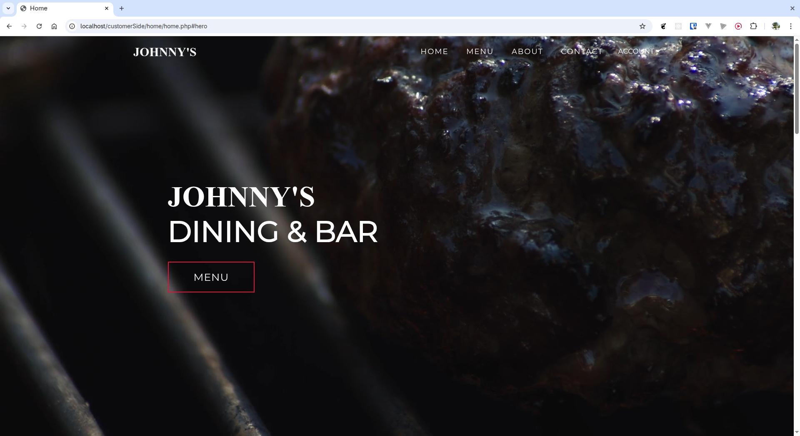
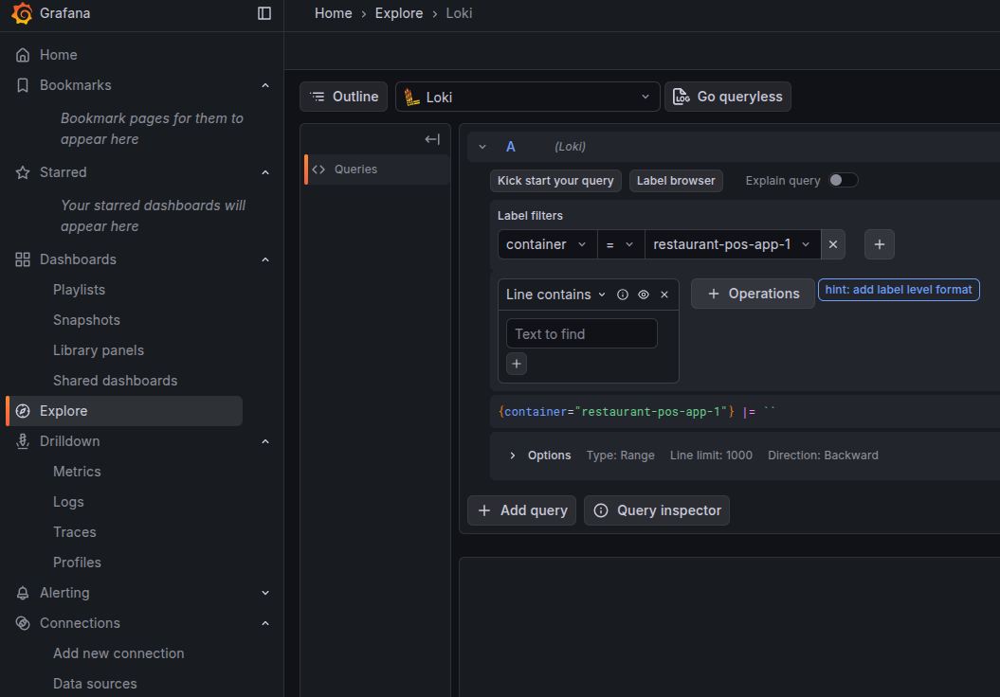
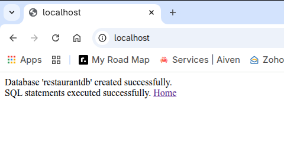
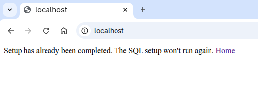
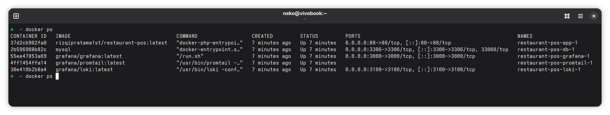
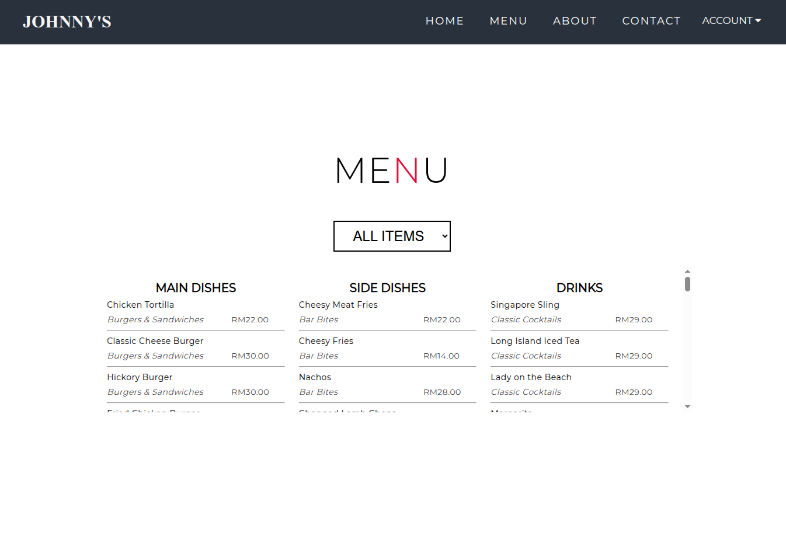
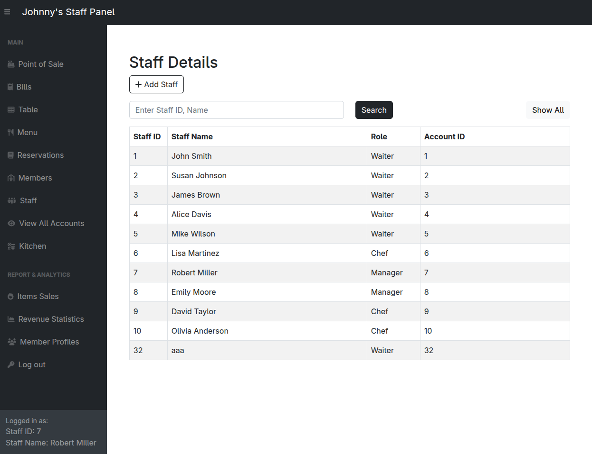
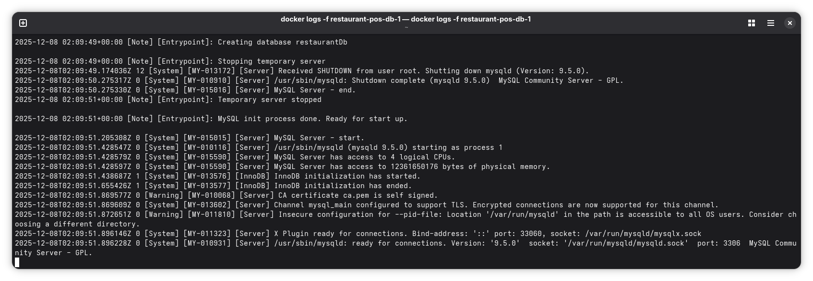
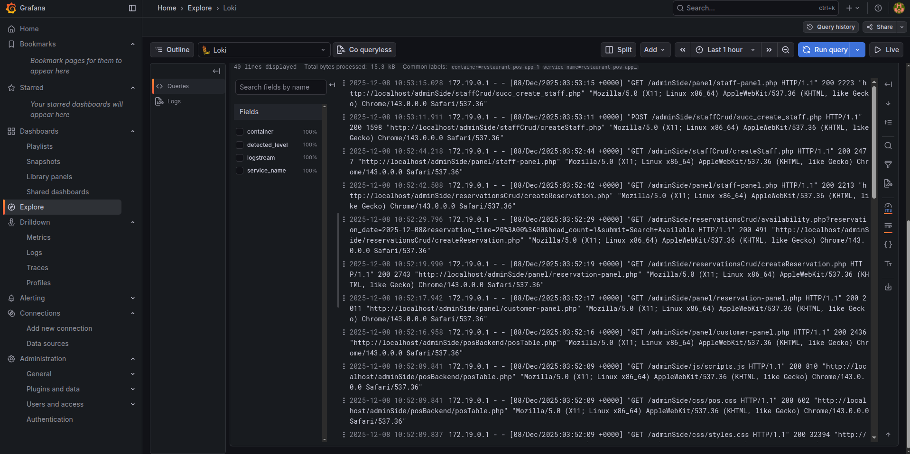
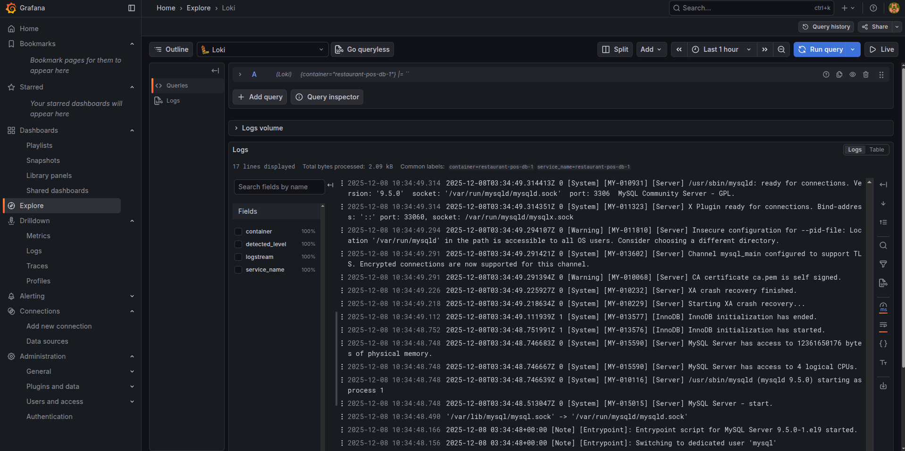

# Restaurant POS

Restaurant Management System with Website and POS. This system includes a **customer-facing website**, a **POS system for ordering**, and the ability to **create, store, update, and delete** bills, menu items, and more. It is primarily built using **PHP**.

**DevOps By:** @rpratama-codes

**Repository:** <https://github.com/rpratama-codes/restaurant-pos>  
**Registry:** <https://hub.docker.com/r/rizqipratama1st/restaurant-pos>  
**Docker Image Name:** `rizqipratama1st/restaurant-pos`

## Features

### Customer Side (`customerSide` Folder)

Stores the website and allows customers to:

* Make reservations
* Register for accounts
* View profile points

### Staff Side (`adminSide` Folder)

Stores the staff panels and allows staff to:

* Take orders
* Send orders to the kitchen
* Process payments
* Print receipts
* Manage CRUD operations (Create, Read, Update, Delete)
* View user preferences
* Download reports
* View charts and graphs

## Requirements

* PHP 7.4
* Composer (package manager)
* Code Editor (Recommended: VSCode)
* Make (tooling) - *optional*

## Setup

1. Install the required dependencies listed above.
2. Run the command `composer install`.
3. Set up the environment by copying `.env.example` to `.env`.
4. Fill in the correct environment variables based on the `.env.example` file.
5. You can start the development!.

## Build

* Run the command `docker build .` or `docker build -t restaurant-pos:latest .` (You may need to adjust the image name in your `docker-compose.yml` file after building).
* **Alternatively**, simply push to the `main` branch and wait for the GitHub Action to build the image and update the repository.

## Run

1. Complete the **Setup** steps first.
2. **Run with PHP Development Server:** Use `composer start` or `php -S 127.0.0.1:8080 -t .`
3. **Using XAMPP/WAMP:** Place the project inside the `htdocs` directory.
4. **Using Docker:** Run the command `docker compose up` (or `docker compose up -d` for background mode).
5. If you are using tooling not mentioned above, please configure the setup manually.

> **IMPORTANT!**
>
> * For local development with a local database, use **`127.0.0.1`** instead of `localhost` for `DB_HOST`.
> * When running on Docker, use the container name (e.g., **`db`**) for `DB_HOST`, or the remote host address.

## URLs

* **App:** <http://localhost> (default http port) or <http://localhost:8080>
* **Loki:** <https://loki:3100>
* **Grafana:** <http://localhost:3000>
* **Database (DB):** Refer to the `docker-compose.yml` file for connection details.

## Example Accounts

| Role     | Email                  | Password    |
| :------- | :--------------------- | :---------- |
| Customer | <dadsvawvid@gmail.com> | david4pass  |
| Customer | <zoe@gmail.com>        | passworddef |
| Customer | <jackie@gmail.com>     | passwordstu |
| Staff    | 1                      | password123 |
| Staff    | 10                     | davidpa2ss  |
| Staff    | 7                      | robertpass  |
| Admin    | 99999                  | 12345       |

## Monitoring

The system currently monitors the logs, which are accessible via Grafana. Screenshots are available below. Use the credentials below to access the Grafana dashboard.

> **Grafana Access:**
>
> * **URL:** <http://localhost:3000>
> * **Username:** `admin`
> * **Password:** `admin`

After logging in, click the **`explore`** tab, select **Loki** as the datasource, and then use the `container` label filter to choose the container you wish to view logs from.

## Database Migration

The application includes a migration setup. To rerun the migration, simply remove the `setup_completed.flag` file and `truncate` or `delete` all data from the application's database. Inside the container, the `setup_completed.flag` file is stored in a Docker volume, allowing the application to track the migration state.

> **My Opinion:** Database operations should ideally be run **Manually** to prevent accidental data loss.

| First Time                                | Second Time                                 |
| :---------------------------------------- | :------------------------------------------ |
|  |  |

## Screenshots (Proves)

### Please click to view fullscreen

### Running Services

### App Interface

| Home                                    | Admin                                     |
| :-------------------------------------- | :---------------------------------------- |
|  |  |

### Database Terminal

### Grafana Dashboard

| App Logs                            | DB Logs                          |
| :---------------------------------- | :---------------------------------- |
|      |  |

## Contributors

| Name  | Github                              |
| :---- | :---------------------------------- |
| Bryan | <https://github.com/BryanTheLai>    |
| Yong  | <https://github.com/ahhyang>        |
| Kevin | <https://github.com/kevin07212004>  |
| Edzer | <https://github.com/edsaur>         |
| Rizqi | <https://github.com/rpratama-codes> |
